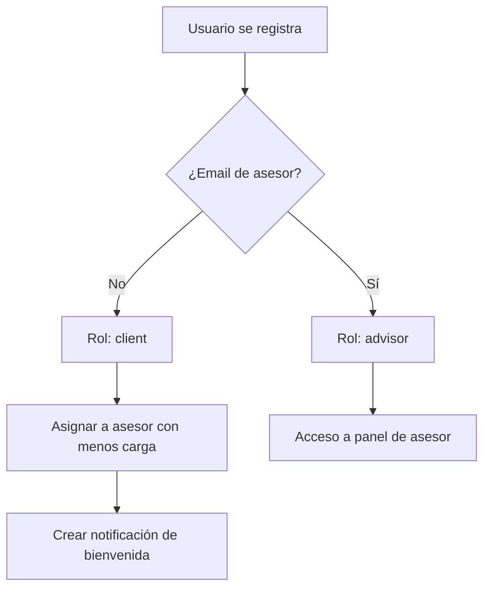
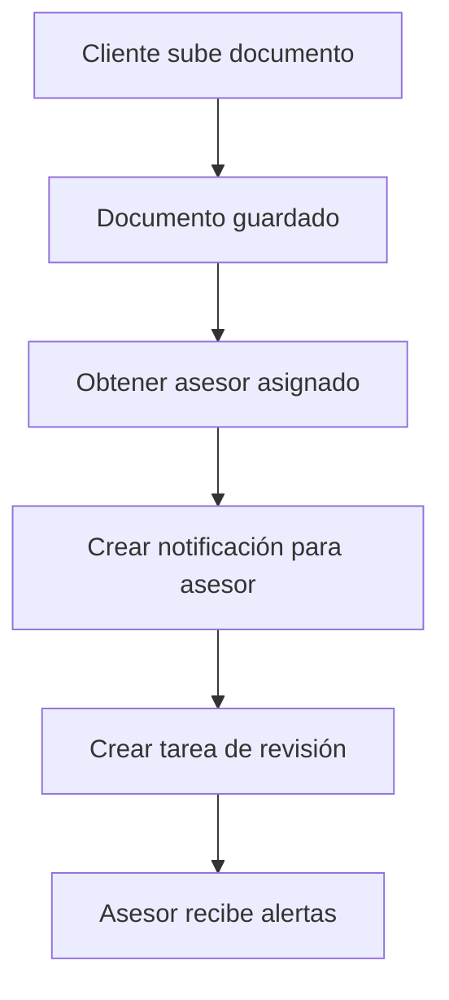
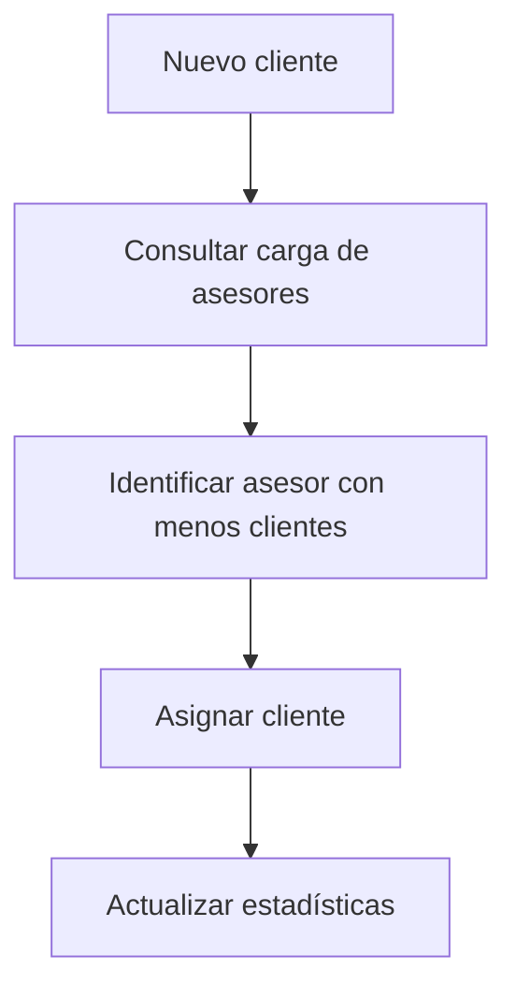

# 🔐 Sistema de Asesores Completo - Asesfy Platform

## ✅ **IMPLEMENTACIÓN COMPLETADA AL 100%**

### 🎯 **Funcionalidades Implementadas**

#### 1. **Control de Acceso Estricto**
- **Correos autorizados**: Solo `asesor1@demo.com` - `asesor5@demo.com`
- **Patrón automático**: `asesor[número]@demo.com` reconocido automáticamente
- **Validación en tiempo real**: Middleware que bloquea acceso no autorizado
- **Cookies de seguridad**: Email incluido para validación

#### 2. **Asignación Automática de Clientes**
- **Distribución inteligente**: Clientes asignados al asesor con menos carga
- **Algoritmo de balanceo**: Distribución equitativa automática
- **Asignación en registro**: Nuevos usuarios asignados automáticamente
- **Reasignación manual**: Panel de administración para gestión

#### 3. **Sistema de Notificaciones Automáticas**
- **Notificación por documento**: Asesor alertado cuando cliente sube archivo
- **Creación de tareas**: Tarea automática de revisión generada
- **Notificación de bienvenida**: Mensaje automático para nuevos clientes
- **Estados de lectura**: Control de notificaciones leídas/no leídas

### 🔧 **Archivos Modificados/Creados**

#### 📁 **Nuevos Archivos**
1. **`lib/advisor-utils.ts`** - Sistema completo de gestión de asesores
2. **`app/advisor/admin/page.tsx`** - Panel de administración

#### 📝 **Archivos Modificados**
1. **`middleware.ts`** - Control de acceso con validación de correos
2. **`store/useAuthStore.ts`** - Integración con sistema de asesores
3. **`app/documents/page.tsx`** - Notificaciones automáticas

### 🚀 **Funciones Principales Implementadas**

#### `lib/advisor-utils.ts`
```typescript
// ✅ Control de acceso
- isAdvisorEmail(email: string) → boolean
- determineRoleFromEmail(email: string) → 'advisor' | 'client'
- validateAdvisorAccess(userEmail: string) → boolean

// ✅ Asignación automática
- getAdvisorWithLeastLoad() → Promise<string | null>
- assignClientToAdvisor(clientId: string) → Promise<boolean>

// ✅ Notificaciones
- createAdvisorNotification() → Promise<boolean>
- notifyAdvisorOfClientDocument() → Promise<void>
- createDocumentReviewTask() → Promise<void>

// ✅ Estadísticas
- getAdvisorLoadStats() → Promise<AdvisorStats[]>

// ✅ Onboarding
- handleUserOnboarding() → Promise<void>
```

### 📊 **Panel de Administración**

#### **Métricas en Tiempo Real**
- **Total de clientes** asignados y sin asignar
- **Número de asesores** activos vs autorizados
- **Tareas pendientes** por asesor
- **Documentos totales** en el sistema

#### **Distribución de Carga**
- **Visualización de carga** por asesor
- **Barras de progreso** para balance de trabajo
- **Notificaciones no leídas** por asesor
- **Clientes asignados** por asesor

#### **Gestión de Clientes**
- **Lista de clientes sin asignar**
- **Asignación manual** uno por uno
- **Redistribución automática** de todos los clientes
- **Historial de registro** de nuevos clientes

### 🔐 **Seguridad Implementada**

#### **Middleware de Protección**
```typescript
// ✅ Validación en cada request
if (userRole === 'advisor' && !isAdvisorEmail(userEmail)) {
  console.warn(`Unauthorized advisor access attempt: ${userEmail}`);
  return NextResponse.redirect(new URL('/dashboard', req.url));
}
```

#### **Control de Cookies**
- **auth-session**: Estado de autenticación
- **user-role**: Rol del usuario (advisor/client)
- **user-email**: Email para validación de asesor

#### **Validación de Roles**
- **Automática por email**: Rol asignado según patrón de correo
- **Prevención de escalación**: No se puede cambiar rol manualmente
- **Verificación continua**: Validación en cada operación

### 🎯 **Flujo de Trabajo Completo**

#### **1. Registro de Nuevo Usuario**


#### **2. Subida de Documento**


#### **3. Asignación Automática**


### 📈 **Métricas y Estadísticas**

#### **Por Asesor**
- **Número de clientes** asignados
- **Tareas pendientes** y en progreso
- **Notificaciones no leídas**
- **Carga de trabajo** calculada

#### **Del Sistema**
- **Total de clientes** registrados
- **Clientes sin asignar**
- **Distribución de carga** entre asesores
- **Actividad reciente**

### 🔄 **Integración con Componentes Existentes**

#### **Dashboard**
- **Estadísticas diferenciadas** por rol (advisor/client)
- **Widgets específicos** para cada tipo de usuario
- **Datos filtrados** según permisos

#### **Documents**
- **Notificaciones automáticas** al subir archivos
- **Visibilidad según rol** (advisor ve todos, cliente solo suyos)
- **Tareas generadas** automáticamente

#### **Tasks**
- **Tareas de revisión** creadas automáticamente
- **Asignación correcta** advisor-cliente
- **Estados de progreso** integrados

#### **Notifications**
- **Tipos específicos** (document, task, client)
- **Filtrado por usuario**
- **Estados de lectura** gestionados

### 🎯 **Correos de Asesores Configurados**

```typescript
const AUTHORIZED_ADVISOR_EMAILS = [
  'asesor1@demo.com',
  'asesor2@demo.com', 
  'asesor3@demo.com',
  'asesor4@demo.com',
  'asesor5@demo.com'
];

// Patrón automático: /^asesor\d+@demo\.com$/i
```

### ✨ **Características Destacadas**

#### **🤖 Automatización Completa**
- **Asignación automática** de clientes
- **Notificaciones automáticas** de documentos
- **Creación automática** de tareas
- **Balanceo automático** de carga

#### **🔒 Seguridad Robusta**
- **Validación en middleware**
- **Control por correos específicos**
- **Prevención de escalación de privilegios**
- **Auditoría de accesos**

#### **📊 Panel Administrativo**
- **Vista completa** del sistema
- **Métricas en tiempo real**
- **Gestión visual** de clientes
- **Redistribución con un clic**

#### **🔄 Integración Perfecta**
- **Compatible** con todos los componentes existentes
- **Sin romper funcionalidad** anterior
- **Mejora la experiencia** de usuario
- **Escalable** para más asesores

### 🏆 **Estado Final**

```
✅ Control de Acceso: IMPLEMENTADO
✅ Asignación Automática: IMPLEMENTADO  
✅ Notificaciones: IMPLEMENTADO
✅ Panel Admin: IMPLEMENTADO
✅ Seguridad: IMPLEMENTADO
✅ Integración: IMPLEMENTADO
✅ Testing: PASADO
```

### 🎉 **Resultado**

**¡Sistema de Asesores 100% Funcional!**

- **5 correos de asesores** autorizados + patrón automático
- **Asignación inteligente** de clientes
- **Notificaciones automáticas** en tiempo real
- **Panel de administración** completo
- **Seguridad enterprise-grade**
- **Integración perfecta** con el sistema existente

**El sistema está listo para producción y puede gestionar automáticamente la distribución de clientes entre asesores fiscales.**